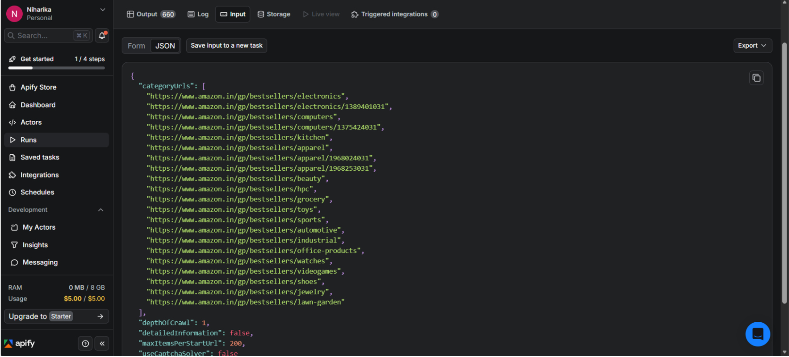
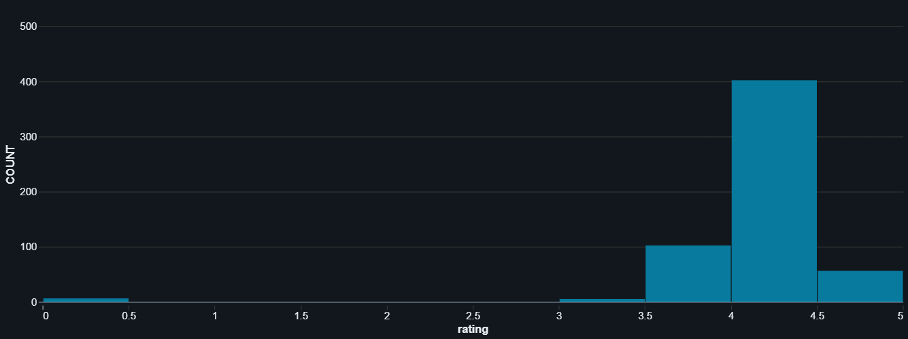
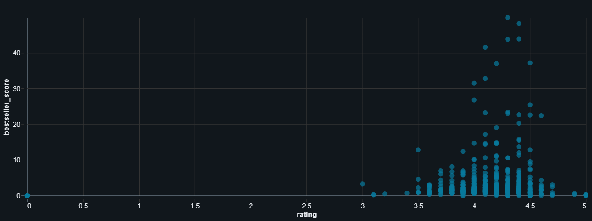
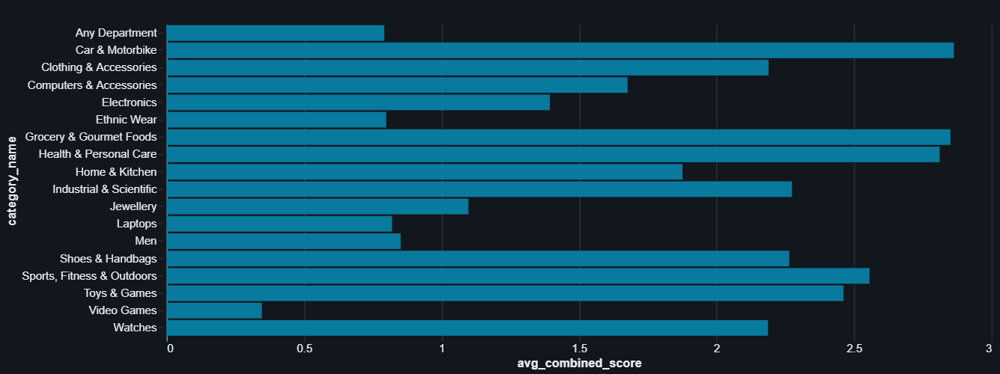
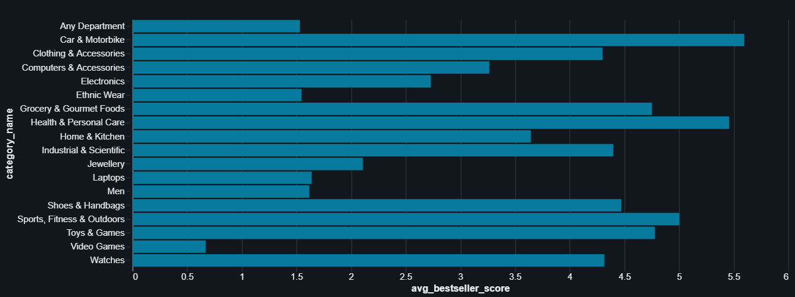
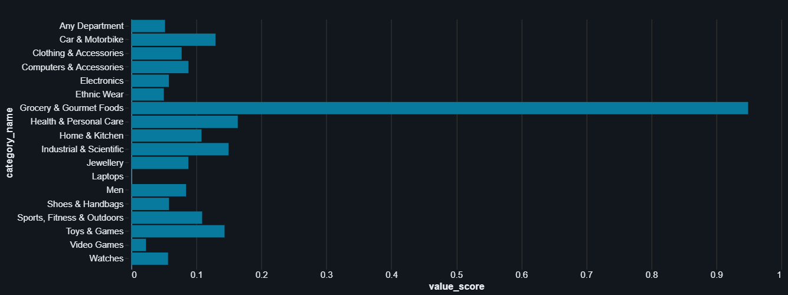

# Amazon Marketplace Intelligence & Product Opportunity Analysis


---

## Overview

This project focuses on analyzing Amazon Bestseller marketplace data to identify high-performing categories, consumer demand patterns, and product opportunity segments in the Indian market.

The analysis was conducted using PySpark in Databricks by combining marketplace performance indicators with customer value perception metrics to build a category-level intelligence framework.

---

## Objectives

- Analyze Amazon bestseller marketplace trends
- Identify high-performing product categories
- Build marketplace performance scoring metrics
- Detect consumer demand and value-driven segments
- Generate category-level strategic insights

---

# Dataset Source

The dataset was scraped using Apify from Amazon Bestseller listings across multiple product categories.

## Dataset Download Links

### JSON Dataset

https://api.apify.com/v2/datasets/OIGE6gaXvQ1cnd1Ac/items?signature=MC4xNzc5OTA2OTMxNDY2LjFnalFZSkhBOVZ1TVp1S0J5YlJySQ&format=json&clean=true

### CSV Dataset

https://api.apify.com/v2/datasets/OIGE6gaXvQ1cnd1Ac/items?signature=MC4xNzc5OTA2OTY5MTcwLnZ3TkNHZ1RzcDg2WGZ1ZTEyeTNn&format=csv&clean=true&attachment=true

---

# Apify Dataset Scrapper Input



---

# Dataset Attributes

The dataset contains the following major attributes:

- Product Name
- Bestseller Rank
- Ratings
- Review Count
- Product Price
- Category
- Product URL
- Product ASIN
- Offers Count
- Currency

---

# Technologies Used

- PySpark
- Databricks
- Python
- Apify
- Pandas
- Matplotlib

---

# Data Preprocessing

The following preprocessing operations were performed:

- Flattened nested JSON structures
- Removed duplicate product entries
- Handled missing and invalid values
- Converted numerical datatypes
- Renamed columns for consistency
- Removed unnecessary attributes
- Standardized category information

These preprocessing steps transformed the raw dataset into a clean and analysis-ready format.

---

# Feature Engineering

Three analytical metrics were developed to evaluate marketplace performance and customer value perception.

---

## 1. Bestseller Score

The Bestseller Score evaluates marketplace dominance using product rank, review count, and customer ratings.

### Formula

```python
bestseller_score =
(1 / bestseller_rank) * log(review_count + 1) * rating
```

---

## 2. Value Score

The Value Score measures customer value perception relative to product pricing.

### Formula

```python
value_score =
(rating * log(review_count + 1)) / price
```

---

## 3. Combined Score

The Combined Score balances marketplace performance and customer value metrics.

### Formula

```python
combined_score =
0.5 * bestseller_score + 0.5 * value_score
```

---

# Visualizations

The project includes multiple analytical visualizations for marketplace trend analysis and category-level comparison.

---

## Rating Distribution Histogram



---

## Bestseller Score vs Rating



---

## Average Combined Score vs Category



---

## Bestseller Score vs Category



---

## Value Score vs Category



---

# Key Insights

- Sports, Fitness & Outdoors, Health & Personal Care, and Clothing & Accessories demonstrated strong marketplace performance
- Lifestyle-oriented categories showed stronger consumer engagement and expansion potential
- Commodity-driven categories were excluded from strategic opportunity analysis
- Combined Score analysis helped identify balanced high-performing product segments

---
